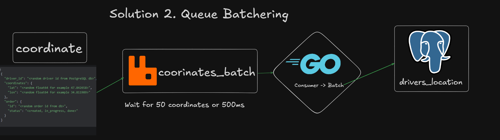

# Coordinates Batch

## Issue:
every coordinate INSERT ino db create Transaction. 
for 1 order its 50 transactions. 
for 10 000 orders its 500 000 transactions.
#### We need to optimaze that.

## Solution



## Config 

For control batch size and timeout between automatic inserting use config.yaml.
```yaml
batch:
  batch_size: 50 # maximum size of the batch
  wait_timeout: 500ms # maximum timeout between automatic inserting
  coordinates_chan_size: 1000 # size of channel that transfer coordinates data to batch
```

## Bottlenecks
 1. coordinates may not be stored in the order of appearance
    (especially after adding workers)
#### How to fix?
use ORDER BY created_at for getting order / driver history.
 
 2. There isn't transactions with order data , 
    so even if order doesn't finished data will be on db.